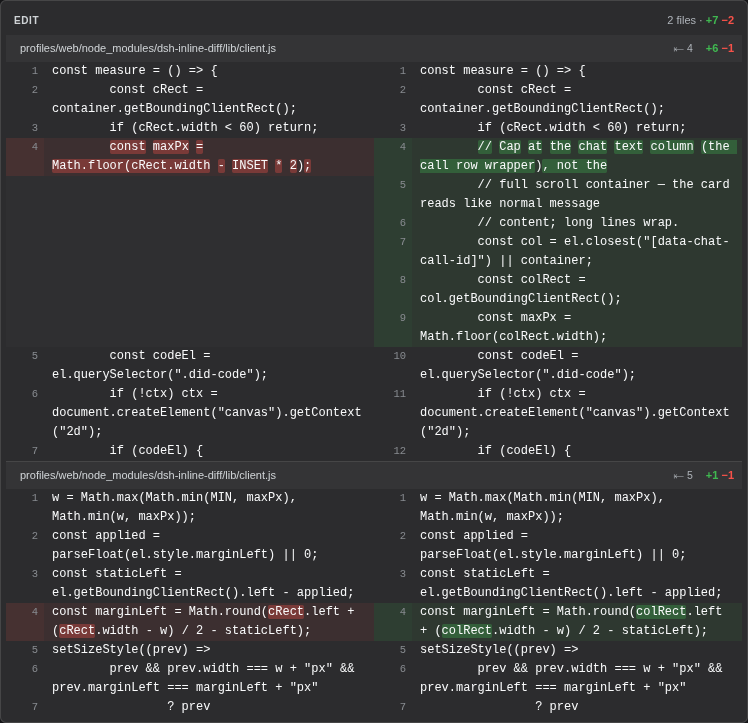

# dsh-inline-diff

See every file your agent edits — right in the chat, no clicking required.

By default the DeepSeek Harness web GUI collapses each file edit into a tiny one-line row. This plugin replaces those rows with an always-open, side-by-side diff: old code on the left, new code on the right, additions in green, deletions in red, with line numbers and a `+N −N` summary for every file.

| | |
|---|---|
| Without | collapsed rows, one click per file to see what changed |
| **With** | the full diff is just there, in the conversation |

## What it looks like

A typical edit: changed lines paired side by side, with the exact words that changed highlighted:



Smaller edits stay compact:


## Words or whole lines

By default a changed line gets double highlighting: the row is tinted green/red, and on top of that the exact words that changed get a stronger highlight. Prefer it calmer? Open **Settings → Plugins → Inline diff** and pick *Lines only*. You keep the row tint but lose the word chips. The choice is saved in your DSH settings and survives restarts.

## Indentation

Edits often arrive indented with their surrounding code, which pushes the actual change toward the middle of the card. By default the diff strips the leading whitespace every non-empty line shares, so changes sit closer to the gutter; a small `⇤ N` badge on the file header shows how many characters were removed. Prefer seeing the code as written? Pick *Keep* under **Settings → Plugins → Inline diff** and the original indentation stays. Like the highlighting choice, this is saved and survives restarts.

## Themes

Every color on the card, from surfaces and text to borders and the green/red diff tints, is derived from your GUI's theme tokens (Settings → Appearance). The card follows light mode, dark mode, and any custom accent colors instead of a fixed palette.

## Install

**With the `dsh` CLI** (easiest):

```sh
dsh plugin --profile web add github:JanEickholt/dsh-inline-diff
```

**From GitHub** (manual, same result):

1. Add the plugin to your profile's `package.json`:

   ```json
   "dsh-inline-diff": "github:JanEickholt/dsh-inline-diff"
   ```

   then run `pnpm install` in the profile directory.

2. Add it to your profile's `cordis.patch.yml`:

   ```yaml
   - insert:
       - id: inline-diff
         name: 'dsh-inline-diff'
   ```

3. Refresh the GUI page. Done. Every edit and file write now renders as an inline diff.

**Manual**: copy this repository into `<profile>/node_modules/dsh-inline-diff/` and add the same patch row.

## Contributing

Contributions of any kind are welcome: code, bug reports, docs, design ideas, screenshots, or just telling us what confused you. Open an issue or a pull request; nothing is too small.

## About this project

This plugin was written by an AI coding agent (with a human steering it).

## License

MIT
