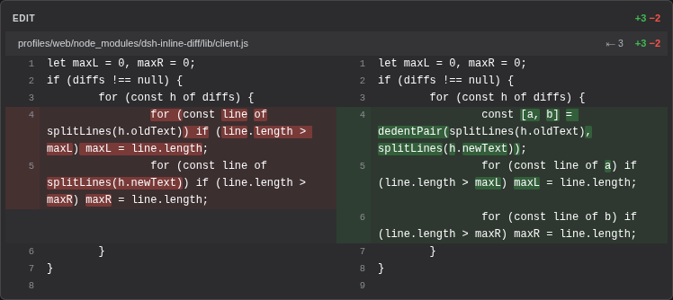
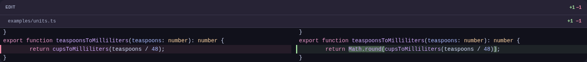

# dsh-inline-diff

[English](README.md) | 简体中文

智能体改动的每一个文件，直接在对话里看，无需点击。

默认情况下，DeepSeek Harness Web GUI 会把每次文件编辑折叠成一行小字。本插件将这些行替换为始终展开的左右对照 diff：左侧旧代码，右侧新代码，新增为绿色，删除为红色，每个改动行都带彩色边缘标记，悬停时会高亮所在行，每个文件都带 `+N −N` 统计。

| | |
|---|---|
| 安装前 | 折叠成一行，每个文件都要点一下才能看到改动 |
| **安装后** | 完整 diff 直接呈现在对话中 |

## 效果预览

一次典型的编辑：改动行左右配对，精确到词的高亮：



## 词级或整行高亮

默认情况下，被改动的行有双层高亮：整行染成绿色/红色，其上变化的词还有更强的高亮。想安静一点？打开 **设置 → 插件 → 行内 Diff**，选择*仅整行*：保留整行底色，去掉词级色块。该选择保存在 DSH 设置中，重启后依然生效。

## 行号

每行两侧都有 1 基行号，位于柔和的行号栏中。行号来自 harness 本身：编辑落定时，插件会把每个 served 的 hunk 锚定到真实位置；没有锚点的 hunk 则通过受限的工作区读取路由读取文件，逐字定位变更块。无法定位的 hunk（块出现多次、文件已漂移、宿主半边缺席）会退回到从 hunk 首行起算的窗口相对编号，行号栏因此始终有数字——但那可能不是文件里的真实行号。

## 缩进

编辑内容常带着周围代码的缩进一起到来，把真正的改动挤到卡片中间。默认情况下，diff 会去掉所有非空行共享的前导空白，让改动更贴近左侧；文件头上的小 `⇤ N` 徽标显示去掉了多少字符。想按原样查看代码？在 **设置 → 插件 → 行内 Diff** 下选择*保留*，原始缩进原样保留。与高亮选择一样，保存且重启后生效。

## 语言

插件卡片自带英文和简体中文两套文案，跟随**设置 → 通用 → 语言**里选择的界面语言；没有存储的选择时跟随浏览器语言。缺失的翻译会回退到英文。

## 语法高亮

代码行由内置的 highlight.js 着色（与解决方案资源管理器侧栏相同的语言集），编辑看起来像编辑器：关键字用主题强调色、字符串绿色、注释弱化等等。token 读取 GUI 代码块渲染所用的同一组 `--shiki-token-*` 变量；语言根据文件扩展名判断，未知扩展名保持纯文本。想要纯文本？在 **设置 → 插件 → 行内 Diff → 语法高亮** 下选择*关*。与其他选择一样，保存且重启后生效。

兼容 [dsh-stylevault](https://github.com/GptsApp/dsh-stylevault)：它的颜色面板覆盖的正是这组 `--shiki-token-*` 变量，在那里调整主题，diff 卡片会跟着变。

## 主题

卡片上的每一种颜色——从表面、文字、边框到绿/红 diff 底色——都取自 GUI 的主题 token（设置 → 外观）。卡片会跟随浅色模式、深色模式以及自定义强调色，而不是固定配色。语法 token 颜色走同一套体系（GUI 的 shiki 代码配色）；主题变量尚不存在时，它们就是卡片的普通文字颜色。

同样一处紧凑编辑在自定义主题下的效果——[dsh-stylevault](https://github.com/GptsApp/dsh-stylevault) 覆盖的正是这组 token 变量，在那里重新配色，所有 diff 卡片都会跟着变：



## 安装

**使用 `dsh` CLI**（最简单）：

```sh
dsh plugin --profile web add github:JanEickholt/dsh-inline-diff
```

**从 GitHub 手动安装**（效果相同）：

1. 把插件加入 profile 的 `package.json`：

   ```json
   "dsh-inline-diff": "github:JanEickholt/dsh-inline-diff"
   ```

   然后在 profile 目录运行 `pnpm install`。

2. 把它加入 profile 的 `cordis.patch.yml`：

   ```yaml
   - insert:
       - id: inline-diff
         name: 'dsh-inline-diff'
   ```

3. 刷新 GUI 页面。完成。现在每次编辑和文件写入都会渲染为行内 diff。

**完全手动**：把本仓库复制到 `<profile>/node_modules/dsh-inline-diff/`，并添加同样的 patch 行。

## 参与贡献

欢迎任何形式的贡献：代码、bug 反馈、文档、设计想法、截图，或者只是告诉我们哪里让你困惑。提交 issue 或 pull request 即可，再小都有价值。

## 关于本项目

本插件由 AI 编程智能体编写（由人类引导）。

## 许可证

MIT
